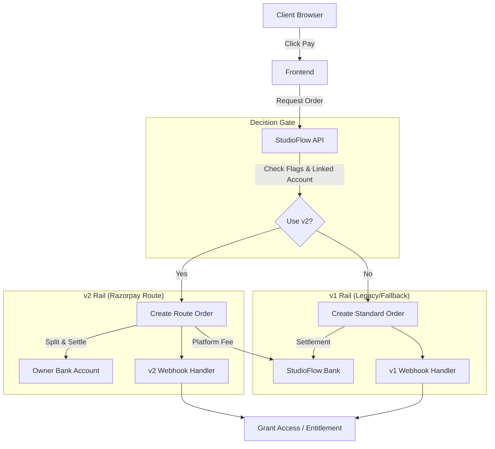

# StudioFlow Payment Architecture V2: Direct-to-Owner Settlement

**Status**: Approved  
**Date**: December 19, 2025  
**Author**: Principal Payments Architect  
**Applies to**: Project Invoices ONLY (Subscriptions remain on v1)

---

## 1️⃣ Executive Summary

### The Problem
Previously, when a client paid a project invoice, the funds settled into StudioFlow's bank account instead of the project owner's account. This occurred because StudioFlow acted as the sole "Merchant of Record" for all transactions.

### The Risk
This created significant compliance and operational risks:
1.  **Regulatory**: StudioFlow was inadvertently acting as an unlicensed payment aggregator by holding and distributing client funds.
2.  **Operational**: Manual reconciliation and payouts were required to get funds to owners.
3.  **Trust**: Owners experienced delays in receiving their earnings.

### The Solution
We are implementing **Razorpay Route**, a split-payment infrastructure.
*   **How it works**: When a client pays, Razorpay automatically routes the funds directly to the Owner's bank account (minus a StudioFlow platform fee).
*   **Fund Flow**: Client → Razorpay → Owner (StudioFlow never touches the principal amount).

### Why It Is Safe
We are adopting a **Parallel Rail Strategy**.
*   We are **NOT** changing the existing payment code (v1).
*   We are building a completely separate payment system (v2) alongside it.
*   A "Decision Gate" (Feature Flag) determines which rail to use.
*   If v2 encounters any issue, we can instantly switch back to v1 with zero downtime.

---

## 2️⃣ Current vs Target Architecture

### Current Architecture (v1) - To Be Deprecated for Invoices
*   **Flow**: `razorpay.orders.create` uses StudioFlow's credentials.
*   **Settlement**: 100% of funds settle to StudioFlow.
*   **Risk**: StudioFlow holds "Client Money," creating fiduciary liability and tax complexity.
*   **Status**: Remains active for **Subscriptions** and as a **Fallback** for Invoices.

### Target Architecture (v2) - The New Standard
*   **Flow**: A parallel payment rail specifically for Project Invoices.
*   **Routing**: Uses Razorpay Route `transfers` API to designate the Owner's linked account as the beneficiary at the moment of order creation.
*   **Decision Gate**: A strict logic check determines entry to v2:
    1.  Is `ENABLE_PAYMENT_V2` flag ON?
    2.  Does the Owner have a verified Linked Account?
    3.  Is the Invoice eligible?
*   **Isolation**: v2 has its own API endpoints, webhook handlers, and database fields. It shares **no execution path** with v1 until the final "Entitlement Grant" step.

---

## 3️⃣ System Architecture Diagram

**Flow Explanation:**
1.  **Client** initiates payment.
2.  **Decision Gate** evaluates if the transaction qualifies for Direct Settlement (v2).
3.  **v2 Rail** (if selected) instructs Razorpay to split funds immediately.
4.  **Razorpay** settles funds to the **Owner** and fee to **StudioFlow**.
5.  **Webhooks** (v1 or v2) independently verify the transaction and trigger the **Entitlement** service to unlock files.

---

## 4️⃣ Payment Rail Separation (Critical)

| Concern | v1 (Existing / Subscriptions) | v2 (New / Project Invoices) |
| :--- | :--- | :--- |
| **Payment Type** | Subscriptions & Legacy Invoices | Project Invoices Only |
| **Order Creator** | StudioFlow (Standard) | StudioFlow (via Route) |
| **Settlement Target** | StudioFlow Account | **Owner's Linked Account** |
| **Webhook Endpoint** | `/api/payments/razorpay-webhook` | `/api/payments/v2/project-webhook` |
| **Webhook Secret** | `RAZORPAY_WEBHOOK_SECRET` | `RAZORPAY_ROUTE_WEBHOOK_SECRET` |
| **DB Tracking** | `PaymentThread` (v1 fields) | `PaymentThread` (v2 fields / `paymentRail: 'v2'`) |
| **Entitlement Logic** | `EntitlementService.grant()` | `EntitlementService.grant()` (Shared) |
| **Rollback Strategy** | N/A (Base Layer) | **Disable Feature Flag** |

**Blast Radius Containment**: A bug in v2 cannot affect Subscriptions because they run on entirely different code paths and endpoints.

---

## 5️⃣ Feature Flag & Decision Gate Design

The system uses a multi-layered gate to ensure safety.

### 1. Global Kill Switch
*   **Key**: `ENABLE_PAYMENT_V2` (Database Config / Env Var)
*   **Function**: If `false`, ALL invoice payments force-route to v1.
*   **Use Case**: Emergency shutdown if a critical bug is found in v2.

### 2. Per-Owner Eligibility
*   **Key**: `User.paymentProfile.isRouteReady`
*   **Function**: Checks if the owner has completed KYC and linked their bank account.
*   **Logic**: If `false`, falls back to v1 (StudioFlow collects funds, pays out manually later).

### 3. Emergency Override
*   **Mechanism**: Admin dashboard toggle per user.
*   **Function**: Can force a specific user back to v1 without affecting others.

**Why DB Flags?**
Database flags allow for **instant** state changes without requiring a server restart or deployment, which is critical for incident response.

---

## 6️⃣ Rollout Phases (Operational Playbook)

| Phase | Name | Audience | Entry Condition | Monitoring Focus | Rollback Trigger |
| :--- | :--- | :--- | :--- | :--- | :--- |
| **0** | **Dark / Shadow** | None (Traffic Shadowing) | v2 deployed, Flag OFF | Log "Would have routed to v2" | N/A |
| **1** | **Internal** | StudioFlow Team | Flag ON, Whitelist IDs | Webhook delivery, Settlement accuracy | Any payment failure |
| **2** | **Beta** | Trusted Owners (Opt-in) | Owner KYC Complete | Owner feedback, Bank arrival times | Support ticket spike |
| **3** | **Percentage** | 10% → 50% of Owners | Random Hash / Cohort | Error rates, Latency | Error rate > 1% |
| **4** | **General Availability** | All Eligible Owners | 100% Rollout | System stability | Catastrophic bug |

---

## 7️⃣ Failure Handling & Idempotency

### Acceptable Failures (Self-Healing)
*   **Abandoned Checkout**: User closes window. System cleans up pending orders.
*   **Duplicate Webhook**: Idempotency keys (Event ID) prevent double-processing.
*   **Route API Timeout**: Fallback to v1 for that specific transaction.

### Catastrophic Failures (Page On-Call)
*   **Payment Captured, No Entitlement**: Money taken, files locked. (Requires manual reconciliation).
*   **Settlement Failed**: Funds stuck in limbo. (Requires Razorpay support).
*   **Double Charge**: Race condition in client. (Requires refund).

### Idempotency Strategy
*   **Order Creation**: Use `invoiceId` as the idempotency key for Razorpay orders.
*   **Webhook Processing**: Check `ProcessedWebhook` collection for `event_id` before execution.
*   **Entitlement**: `EntitlementService` checks if access already exists before granting.

---

## 8️⃣ Compliance & Trust Model

### Why Route Reduces Risk
*   **Platform Model**: Razorpay Route classifies StudioFlow as a "Technology Platform," not a "Payment Aggregator."
*   **No Touching Funds**: Client funds move directly to the Owner. StudioFlow only receives the `platform_fee`.
*   **Liability Shift**: The Owner becomes the Merchant of Record for the transaction. Chargebacks are deducted from the Owner's balance, not StudioFlow's operating account.

### Refund Handling
*   Refunds are initiated via StudioFlow but processed by Razorpay.
*   Funds are reversed from the Owner's linked account balance.
*   If the Owner has insufficient funds, Razorpay handles the recovery (negative balance).

---

## 9️⃣ Implementation Guardrails

**⚠️ DO NOT:**
1.  **DO NOT** modify any file in `server/src/controllers/paymentController.js` (v1 logic).
2.  **DO NOT** attempt to share the existing webhook handler for v2 events. Create a new one.
3.  **DO NOT** mix v1 and v2 logic in the same function. Copy-paste is better than coupling.
4.  **DO NOT** bypass the `EntitlementService`. It is the source of truth for access.
5.  **DO NOT** store sensitive banking info in StudioFlow DB. Store only the Razorpay `account_id`.

---

## 🔟 One-Page TL;DR

*   **Objective**: Route invoice payments directly to Owners; stop holding client funds.
*   **Solution**: Razorpay Route (v2) running parallel to existing system (v1).
*   **Safety**: v1 is untouched. v2 is gated by Feature Flags.
*   **Fallback**: If v2 fails or Owner isn't ready, system auto-defaults to v1.
*   **Settlement**: Client → Owner (Direct). StudioFlow gets a fee.
*   **Code Strategy**: **Isolation over DRY**. Separate endpoints, separate webhooks.
*   **Rollout**: Phased (Internal → Beta → Public).
*   **Emergency**: Turn off `ENABLE_PAYMENT_V2` to revert instantly to v1.
*   **Compliance**: We are a Platform, not a Bank.
*   **Golden Rule**: **Don't break Subscriptions.**
